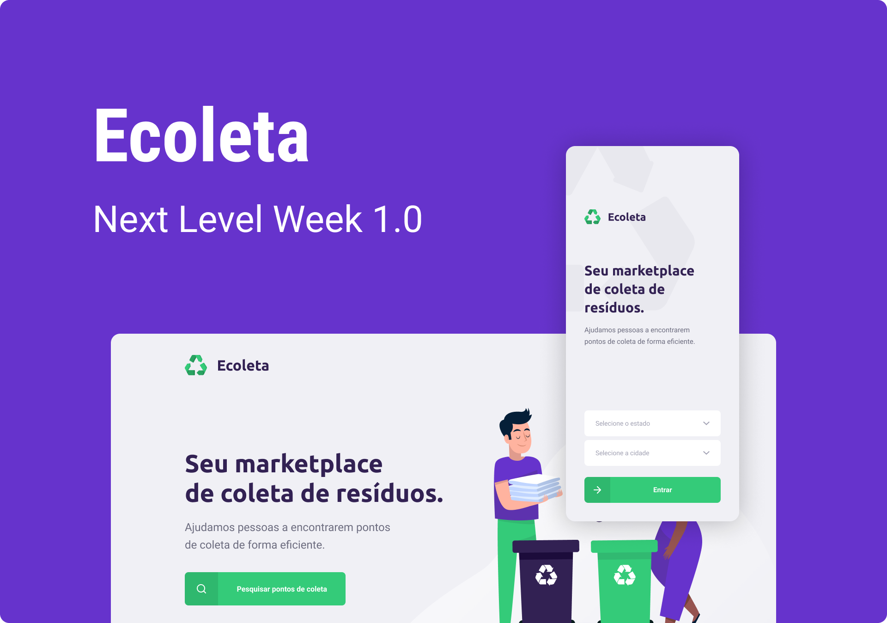
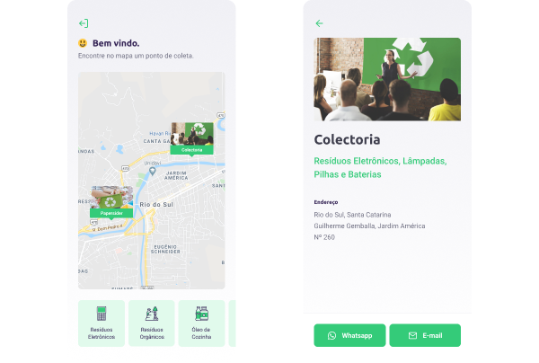

 
 ## 📍 Índice
 
 - [What's Next Level Week?](#-what's-next-level-week)
 - [Project](#-Project)
 - [Technologies](#-Technologies)
 - [Tools](#-Tools)

## What's Next Level Week?
 __NLW__ is a practical week with lots of code, challenges, networking and a single objective: to take you to the next level.  An online and completely free event that will help you take the next step in your evolution as a dev.

## Project
__Ecoleta__ is a project developed based on the International Environment Week. The goal is to connect people to companies that collect specific waste, such as light bulbs, batteries, etc. It has a back-end built with sqlite, a front-end built with react and the mobile made with react-native.

## Technologies

#### This project was developed with the following technologies:

- [TypeScript](https://github.com/Microsoft/TypeScript)
- [Express](https://github.com/expressjs/express)
- [React](https://github.com/facebook/react)
- [React Native](https://github.com/facebook/react-native)
- [Expo](https://github.com/expo/expo)
- [Multer](https://github.com/expressjs/multer)
- [Joi](https://github.com/hapijs/joi)
- [Sqlite](https://www.sqlite.org/index.html)

## Tools
- [Visual Studio Code](https://code.visualstudio.com)
- [Insomnia](https://insomnia.rest)
- [Figma](https://www.figma.com)

###### Developed on Next Level Week from [RocketSeat](https://rocketseat.com.br).

Developed by [Rafael Alves](https://www.linkedin.com/in/rafaelalves91)!
